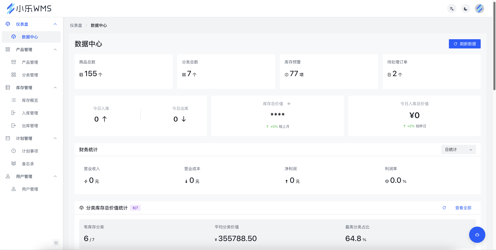
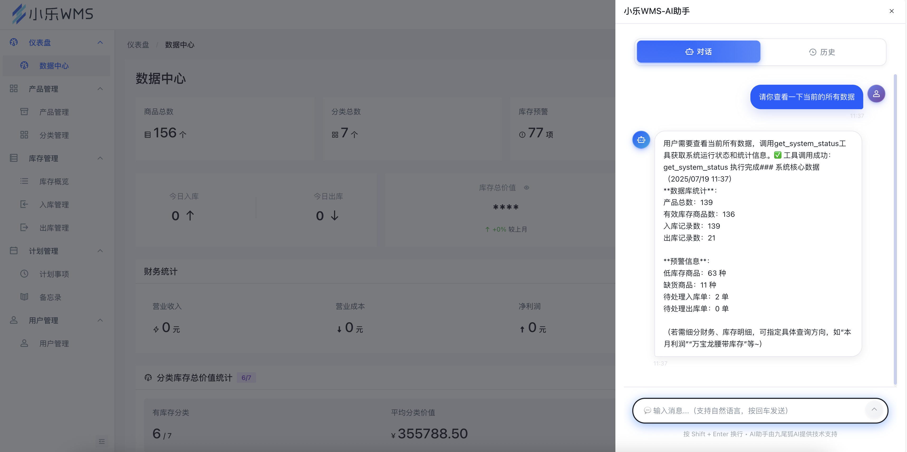
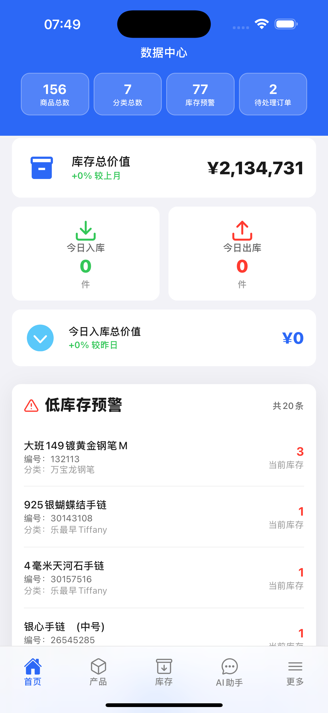
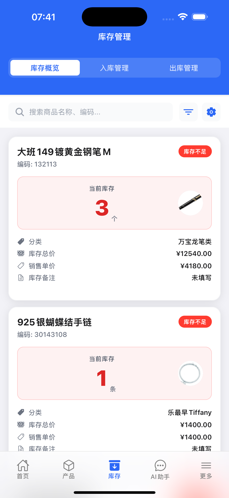
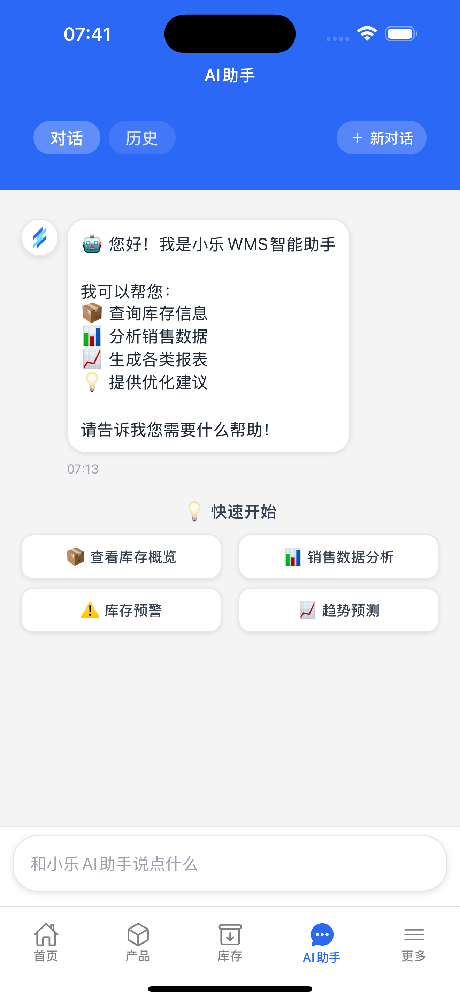
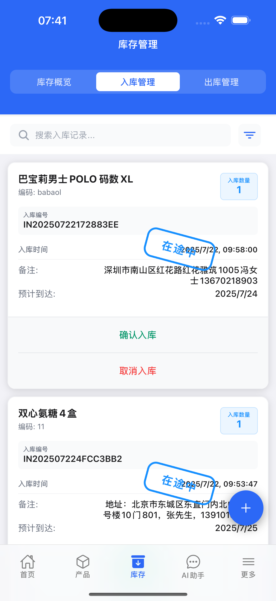
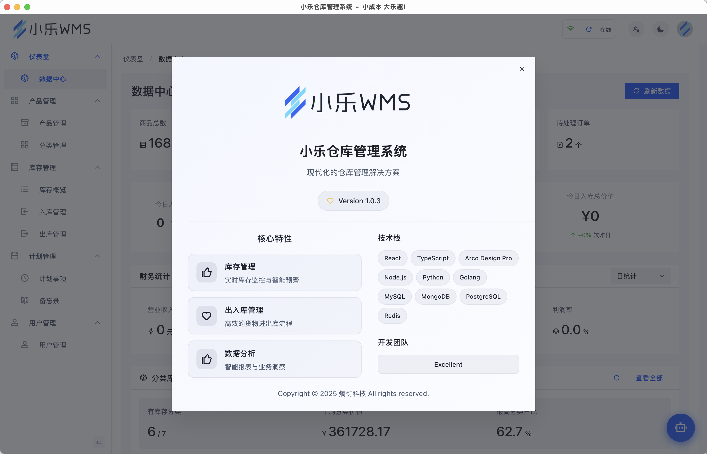
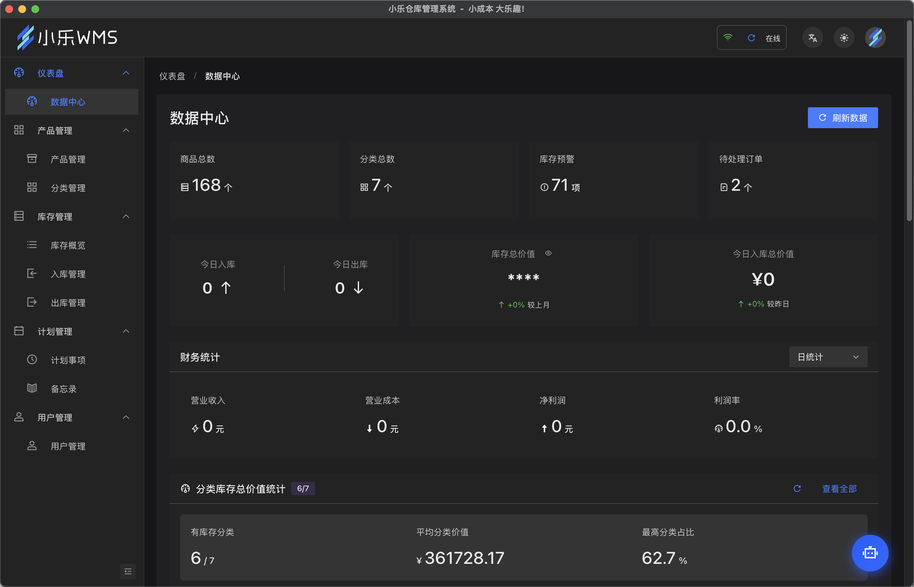
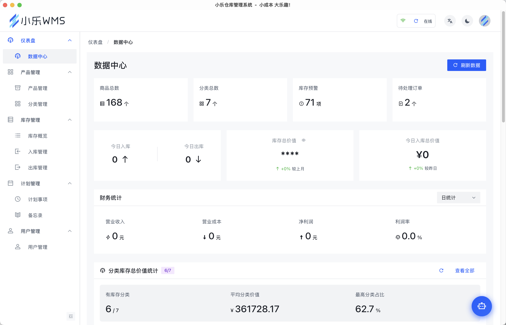

<div align="center">

# 🏭 小乐WMS仓库管理系统


**🚀 现代化、智能化的企业级仓库管理系统**

*让仓库管理更智能、更高效*

**📢 开源说明：本项目开源后端服务和Web前端，提供完整的仓库管理解决方案**

---

[](https://github.com/kkedm/xiaolewms)
[](LICENSE)
[](https://github.com/kkedm/xiaolewms)
[](https://github.com/kkedm/xiaolewms)

[](https://nodejs.org/)
[](https://reactjs.org/)
[](https://www.typescriptlang.org/)
[](https://www.mysql.com/)
[](https://www.docker.com/)

</div>

---

## 📋 项目概述

<div align="center">

**小乐WMS** 是一个功能完整的现代化仓库管理系统，采用前后端分离架构，支持Web端、移动端和桌面端多平台部署。

系统涵盖了仓库管理的完整业务流程，包括产品管理、库存管理、入库出库、数据分析、AI智能助手等核心功能。

**🎯 开源范围**：本项目开源后端API服务和Web前端界面，移动端和桌面端作为完整解决方案的一部分提供参考。

</div>

## 📚 目录结构

```
xiaolewms/
├── 📁 backend/              # 后端服务 (🔓 开源)
│   ├── 📁 src/
│   │   ├── 📁 controllers/   # 控制器
│   │   ├── 📁 models/        # 数据模型
│   │   ├── 📁 routes/        # 路由配置
│   │   └── 📁 middleware/    # 中间件
│   └── 📄 package.json
├── 📁 xiaolewms/            # Web前端 (🔓 开源)
│   ├── 📁 src/
│   │   ├── 📁 components/    # 组件
│   │   ├── 📁 pages/         # 页面
│   │   └── 📁 utils/         # 工具函数
│   └── 📄 package.json
├── 📁 xiaolewmsmobile/      # 移动端应用 (📱 参考实现)
│   ├── 📁 src/
│   │   ├── 📁 screens/       # 页面
│   │   └── 📁 components/    # 组件
│   └── 📄 package.json
├── 📁 xiaolewms-desktop/    # 桌面端应用 (🖥️ 参考实现)
├── 📁 docs/                 # 文档
├── 🐳 docker-compose.yml    # Docker配置
└── 📄 README.md             # 项目说明
```

### ✨ 核心特性

<div align="center">

| 🏗️ 多平台支持 | 🤖 AI智能助手 | 📊 实时数据分析 |
|:---:|:---:|:---:|
| Web端(开源)、移动端<br/>桌面端全覆盖 | 火山方舟AI集成<br/>智能对话分析 | 丰富图表<br/>统计功能 |

| 🔐 权限管理 | 📱 响应式设计 | 🐳 容器化部署 |
|:---:|:---:|:---:|
| 基于角色的<br/>细粒度权限控制 | 适配各种<br/>屏幕尺寸 | Docker<br/>一键部署 |

| 🔄 实时同步 | 📋 任务管理 | 🔔 消息通知 |
|:---:|:---:|:---:|
| 多端数据<br/>实时同步 | 内置任务和<br/>备忘录管理 | 推送通知和<br/>系统提醒 |

</div>

## 🏗️ 技术架构

<div align="center">

### 🎯 系统架构图

<div align="center">

### 🏗️ 系统架构层次图

```
┌─────────────────────────────────────────────────────────────┐
│                        客户端层                              │
├─────────────────┬─────────────────┬─────────────────────────┤
│  🌐 Web前端      │   📱 移动端      │    🖥️ 桌面端              │
│   (开源)         │   (参考)        │    (参考)                │
└─────────────────┴─────────────────┴─────────────────────────┘
                           │
                           ▼
┌─────────────────────────────────────────────────────────────┐
│                        API层                                │
├─────────────────────────────────────────────────────────────┤
│                   🚪 API Gateway                            │
└─────────────────────────────────────────────────────────────┘
                           │
                           ▼
┌─────────────────────────────────────────────────────────────┐
│                        业务层                                │
├─────────────────────────┬───────────────────────────────────┤
│    ⚙️ 业务逻辑层          │         🤖 AI服务                  │
└─────────────────────────┴───────────────────────────────────┘
                           │
                           ▼
┌─────────────────────────────────────────────────────────────┐
│                        数据层                                │
├─────────────────────────┬───────────────────────────────────┤
│    💾 数据访问层          │      🗄️ MySQL数据库                │
└─────────────────────────┴───────────────────────────────────┘
```

**架构说明**：
- **客户端层**：多端统一接入，Web端开源，移动端和桌面端作为参考实现
- **API层**：统一的API网关，处理路由、认证、限流等
- **业务层**：核心业务逻辑处理和AI智能服务
- **数据层**：数据访问抽象和MySQL数据库存储

</div>

</div>

### 🛠️ 技术栈详情

<div align="center">

#### 🌐 前端技术栈 (Web端)

| 技术分类 | 技术选型 | 版本 | 说明 |
|:---:|:---:|:---:|:---:|
| **核心框架** | React + TypeScript | 18+ | 现代化前端框架 |
| **状态管理** | Redux Toolkit | Latest | 状态管理解决方案 |
| **路由管理** | React Router | Latest | 单页应用路由 |
| **UI组件库** | Arco Design Pro | Latest | 企业级UI组件 |
| **样式方案** | Less | Latest | CSS预处理器 |
| **图表组件** | @visactor/react-vchart + BizCharts | Latest | 数据可视化 |
| **构建工具** | Vite | Latest | 快速构建工具 |
| **代码规范** | ESLint + Prettier | Latest | 代码质量保证 |
| **HTTP客户端** | Axios | Latest | 网络请求库 |
| **工具库** | Lodash + dayjs | Latest | 实用工具集 |

#### 📱 移动端技术栈

| 技术分类 | 技术选型 | 版本 | 说明 |
|:---:|:---:|:---:|:---:|
| **核心框架** | React Native + Expo | Latest | 跨平台移动开发 |
| **导航管理** | React Navigation | Latest | 移动端导航 |
| **状态管理** | Redux Toolkit + Redux Persist | Latest | 状态持久化 |
| **表单处理** | React Hook Form + Yup | Latest | 高性能表单 |
| **UI组件** | Gluestack UI + NativeWind | Latest | 移动端UI组件 |
| **样式处理** | TailwindCSS + StyleSheet | Latest | 样式解决方案 |
| **存储方案** | AsyncStorage | Latest | 本地存储 |
| **HTTP客户端** | Axios | Latest | 网络请求库 |

#### 🖥️ 桌面端技术栈

| 技术分类 | 技术选型 | 版本 | 说明 |
|:---:|:---:|:---:|:---:|
| **核心框架** | Tauri | Latest | 轻量级桌面应用 |
| **前端技术** | React + TypeScript | Latest | 复用Web端技术栈 |
| **UI组件库** | Arco Design Pro | Latest | 企业级UI组件 |
| **系统集成** | Tauri APIs | Latest | 原生API调用 |

#### ⚙️ 后端技术栈

| 技术分类 | 技术选型 | 版本 | 说明 |
|:---:|:---:|:---:|:---:|
| **运行环境** | Node.js | 18+ | JavaScript运行时 |
| **开发语言** | TypeScript | Latest | 类型安全 |
| **Web框架** | Express.js | Latest | 轻量级Web框架 |
| **数据库** | MySQL | 8.0+ | 关系型数据库 |
| **ORM框架** | Sequelize | Latest | 对象关系映射 |
| **身份认证** | JWT (JSON Web Token) | Latest | 安全认证 |
| **API文档** | Swagger/OpenAPI | Latest | 接口文档生成 |
| **日志管理** | Winston | Latest | 日志记录 |
| **文件上传** | Multer | Latest | 文件处理 |
| **数据验证** | Joi + express-validator | Latest | 数据校验 |
| **安全防护** | Helmet + CORS + 限流 | Latest | 安全中间件 |
| **AI集成** | 火山方舟AI API | Latest | 智能助手 |

#### 🐳 部署技术栈

| 技术分类 | 技术选型 | 版本 | 说明 |
|:---:|:---:|:---:|:---:|
| **容器化** | Docker + Docker Compose | Latest | 容器化部署 |
| **反向代理** | Nginx | Latest | 负载均衡 |
| **进程管理** | PM2 | Latest | 进程守护 |
| **健康监控** | 自定义健康检查 | - | 服务监控 |

</div>

## 📸 产品演示

<div align="center">

### 🌐 Web端界面展示

| 仪表盘概览 | 库存管理 |
|:---:|:---:|
|  |  |
| *数据概览与实时监控* | *库存管理与统计分析* |

### 📱 移动端界面展示

| 登录界面 | 仪表盘 | 产品管理 |
|:---:|:---:|:---:|
|  |  |  |
| *简洁的登录界面* | *移动端仪表盘* | *产品信息管理* |

| 库存查询 | 出入库管理 |
|:---:|:---:|
|  |  |
| *实时库存查询* | *出入库操作* |

### 🖥️ 桌面端界面展示

| 主界面 | 数据分析 | 系统设置 |
|:---:|:---:|:---:|
|  |  |  |
| *桌面端主界面* | *数据分析图表* | *系统配置管理* |

---

### ✨ 界面特色

- 🎨 **现代化设计**：简洁美观的界面设计，符合现代审美
- 📱 **响应式布局**：完美适配各种屏幕尺寸和设备
- 🌈 **主题定制**：支持明暗主题切换，个性化体验
- 🚀 **流畅交互**：优化的用户体验，操作简单直观
- 📊 **数据可视化**：丰富的图表展示，数据一目了然

</div>

## 🚀 快速开始

> **📢 开源说明**：本项目开源后端服务和Web前端，移动端和桌面端代码作为完整解决方案的参考实现。

### 环境要求

- Node.js 18+
- MySQL 8.0+
- Docker & Docker Compose (可选)

### 方式一：Docker 部署（推荐）

1. **克隆项目**
```bash
git clone https://github.com/kkedm/xiaolewms.git
cd xiaolewms
```

2. **配置环境变量**
```bash
cp env.example .env.production
# 编辑 .env.production 文件，配置数据库密码等信息
```

3. **启动服务**
```bash
docker-compose -f docker-compose.prod.yml up -d
```

4. **访问系统**
- Web端: http://localhost:3000
- API文档: http://localhost:3001/api-docs
- 默认账号: admin@xiaole.com / admin123456

### 方式二：本地开发部署

#### 1. 后端部署

```bash
cd backend

# 安装依赖
npm install

# 配置环境变量
cp .env.example .env
# 编辑 .env 文件，配置数据库连接等信息

# 运行数据库迁移
npm run migrate

# 启动开发服务器
npm run dev

# 或构建生产版本
npm run build
npm start
```

#### 2. Web前端部署

```bash
cd xiaolewms

# 安装依赖
npm install

# 启动开发服务器
npm run dev

# 或构建生产版本
npm run build
npm run preview
```

#### 3. 移动端部署 (参考实现)

```bash
cd xiaolewmsmobile

# 安装依赖
npm install

# 启动开发服务器
npm start

# 运行在特定平台
npm run ios     # iOS
npm run android # Android
npm run web     # Web
```

#### 4. 桌面端部署 (参考实现)

```bash
cd xiaolewms-desktop

# 安装依赖
npm install

# 启动开发服务器
npm run dev

# 构建桌面应用
npm run tauri build
```

## 📱 功能模块

<div align="center">

### 🎯 核心业务模块

<table>
<tr>
<td align="center" width="33%">

**🏠 仪表盘**

数据概览统计<br/>
实时库存监控<br/>
财务数据分析<br/>
低库存预警<br/>
临期产品提醒<br/>
在途商品跟踪

</td>
<td align="center" width="33%">

**📦 产品管理**

产品信息维护<br/>
产品分类管理<br/>
产品图片上传<br/>
批量导入导出<br/>
产品编码自动生成

</td>
<td align="center" width="33%">

**📊 库存管理**

实时库存查询<br/>
库存预警设置<br/>
库存调整记录<br/>
批次管理<br/>
保质期管理

</td>
</tr>
<tr>
<td align="center">

**📥 入库管理**

入库单创建<br/>
供应商管理<br/>
入库审核流程<br/>
在途货物跟踪<br/>
入库统计分析

</td>
<td align="center">

**📤 出库管理**

出库单管理<br/>
客户信息管理<br/>
出库审核流程<br/>
退货处理<br/>
出库统计分析

</td>
<td align="center">

**👥 用户管理**

用户账号管理<br/>
角色权限分配<br/>
登录日志记录<br/>
密码安全策略

</td>
</tr>
<tr>
<td align="center">

**📋 任务管理**

任务创建分配<br/>
进度跟踪<br/>
备忘录管理<br/>
提醒通知

</td>
<td align="center">

**🤖 AI智能助手**

智能对话交互<br/>
数据查询分析<br/>
业务流程指导<br/>
异常预警处理

</td>
<td align="center">

**📁 文件管理**

图片上传处理<br/>
文件批量管理<br/>
存储空间监控

</td>
</tr>
</table>

### ⚙️ 系统管理模块

<table>
<tr>
<td align="center" width="33%">

**⚙️ 系统设置**

基础参数配置<br/>
AI模型配置<br/>
通知设置<br/>
数据备份恢复

</td>
<td align="center" width="33%">

**🔐 权限管理**

权限定义管理<br/>
角色权限配置<br/>
用户权限分配<br/>
操作日志审计

</td>
<td align="center" width="33%">

**📊 数据分析**

库存报表<br/>
销售分析<br/>
成本统计<br/>
趋势预测

</td>
</tr>
</table>

</div>

## 🗄️ 数据库设计

### 核心数据表

#### 用户管理
- `users` - 用户基本信息
- `permissions` - 权限定义
- `role_permissions` - 角色权限关联

#### 产品管理
- `products` - 产品信息
- `categories` - 产品分类
- `suppliers` - 供应商信息
- `customers` - 客户信息

#### 库存管理
- `inventories` - 库存记录
- `inbound_records` - 入库记录
- `inbound_items` - 入库明细
- `outbound_records` - 出库记录
- `outbound_items` - 出库明细

#### 系统管理
- `system_settings` - 系统配置
- `ai_conversations` - AI对话记录
- `tasks` - 任务管理
- `memos` - 备忘录
- `notification_settings` - 通知设置
- `notification_history` - 通知历史

## 🔧 配置说明

### 环境变量配置

#### 数据库配置
```env
DB_HOST=localhost
DB_PORT=3306
DB_NAME=xiaolewms
DB_USER=root
DB_PASSWORD=your_password
```

#### JWT配置
```env
JWT_SECRET=your_jwt_secret_key_here
JWT_EXPIRES_IN=24h
JWT_REFRESH_SECRET=your_jwt_refresh_secret_key_here
JWT_REFRESH_EXPIRES_IN=7d
```

#### 系统配置
```env
SYSTEM_NAME=小乐WMS
SYSTEM_VERSION=1.0.3
ADMIN_EMAIL=admin@xiaole.com
ADMIN_PASSWORD=admin123456
```

### AI配置

系统支持火山方舟AI集成，需要在系统设置中配置：
- API密钥
- 模型选择
- 对话参数
- 功能开关

## 📖 API文档

系统提供完整的RESTful API，支持Swagger文档：

- **API文档地址**: http://localhost:3001/api-docs
- **API基础路径**: http://localhost:3001/api

### 主要API端点

#### 认证相关
- `POST /api/auth/login` - 用户登录
- `POST /api/auth/refresh` - 刷新Token
- `POST /api/auth/logout` - 用户登出

#### 产品管理
- `GET /api/products` - 获取产品列表
- `POST /api/products` - 创建产品
- `PUT /api/products/:id` - 更新产品
- `DELETE /api/products/:id` - 删除产品

#### 库存管理
- `GET /api/inventory/list` - 获取库存列表
- `GET /api/inventory/overview` - 库存概览
- `POST /api/inventory/adjust` - 库存调整

#### 入库管理
- `GET /api/inbound/records` - 获取入库记录
- `POST /api/inbound/records` - 创建入库记录
- `PUT /api/inbound/records/:id` - 更新入库记录

#### 出库管理
- `GET /api/outbound/records` - 获取出库记录
- `POST /api/outbound/records` - 创建出库记录
- `PUT /api/outbound/records/:id` - 更新出库记录

## 🔒 安全特性

### 身份认证
- JWT Token认证
- 刷新Token机制
- 密码加密存储
- 登录失败限制

### 权限控制
- 基于角色的访问控制(RBAC)
- 细粒度权限管理
- API接口权限验证
- 前端路由权限控制

### 数据安全
- SQL注入防护
- XSS攻击防护
- CSRF攻击防护
- 文件上传安全检查

### 系统安全
- 请求频率限制
- 敏感操作日志记录
- 数据备份机制
- 错误信息脱敏

## 📊 性能优化

### 前端优化
- 组件懒加载
- 图片懒加载
- 代码分割
- 缓存策略
- 防抖搜索

### 后端优化
- 数据库索引优化
- 查询结果缓存
- 分页查询
- 连接池管理
- 响应压缩

### 数据库优化
- 索引设计
- 查询优化
- 分表分库准备
- 慢查询监控

## 🧪 测试

### 后端测试
```bash
cd backend
npm run test
npm run test:watch
```

### 前端测试
```bash
cd xiaolewms
npm run test
```

### 移动端测试
```bash
cd xiaolewmsmobile
npm run test
```

## 📦 部署指南

### 生产环境部署

#### 1. 服务器要求
- CPU: 2核心以上
- 内存: 4GB以上
- 存储: 50GB以上
- 操作系统: Linux (推荐Ubuntu 20.04+)

#### 2. 部署步骤

```bash
# 1. 安装Docker和Docker Compose
curl -fsSL https://get.docker.com -o get-docker.sh
sh get-docker.sh

# 2. 克隆项目
git clone https://github.com/kkedm/xiaolewms.git
cd xiaolewms

# 3. 配置环境变量
cp env.example .env.production
vim .env.production

# 4. 启动服务
docker-compose -f docker-compose.prod.yml up -d

# 5. 查看服务状态
docker-compose -f docker-compose.prod.yml ps
```

#### 3. 反向代理配置 (Nginx)

```nginx
server {
    listen 80;
    server_name your-domain.com;

    # 前端静态文件
    location / {
        proxy_pass http://localhost:3000;
        proxy_set_header Host $host;
        proxy_set_header X-Real-IP $remote_addr;
    }

    # API接口
    location /api/ {
        proxy_pass http://localhost:3001;
        proxy_set_header Host $host;
        proxy_set_header X-Real-IP $remote_addr;
    }

    # 文件上传
    location /uploads/ {
        proxy_pass http://localhost:3001;
        client_max_body_size 10M;
    }
}
```

### 移动端发布 (参考实现)

#### iOS发布
```bash
cd xiaolewmsmobile
expo build:ios
```

#### Android发布
```bash
cd xiaolewmsmobile
expo build:android
```

### 桌面端发布 (参考实现)

```bash
cd xiaolewms-desktop
npm run tauri build
```

## 🔧 维护指南

### 日志管理
- 应用日志: `/app/logs/`
- 访问日志: Nginx日志
- 错误日志: 系统错误日志

### 数据备份
```bash
# 数据库备份
docker exec xiaole-mysql mysqldump -u root -p xiaolewms > backup.sql

# 文件备份
docker cp xiaole-backend:/app/uploads ./uploads-backup
```

### 监控指标
- 系统资源使用率
- 数据库连接数
- API响应时间
- 错误率统计

## 🤝 贡献指南

### 开发流程

1. **Fork 项目** - 访问 [GitHub仓库](https://github.com/kkedm/xiaolewms) 并Fork到你的账户
2. **创建功能分支**
   ```bash
   git checkout -b feature/AmazingFeature
   ```
3. **提交更改**
   ```bash
   git commit -m 'feat: Add some AmazingFeature'
   ```
4. **推送到分支**
   ```bash
   git push origin feature/AmazingFeature
   ```
5. **创建 Pull Request** - 在GitHub上创建PR并等待审核

### 代码规范
- 使用 ESLint 和 Prettier
- 遵循 TypeScript 最佳实践
- 编写单元测试
- 更新相关文档

### 提交规范
```
feat: 新功能
fix: 修复bug
docs: 文档更新
style: 代码格式调整
refactor: 代码重构
test: 测试相关
chore: 构建过程或辅助工具的变动
```

## 📄 许可证

<div align="center">

[](https://opensource.org/licenses/MIT)

**本项目采用 MIT 许可证**

*开源、免费、可商用*

查看 [LICENSE](LICENSE) 文件了解详情

---

### 🎉 感谢使用小乐WMS！

如果这个项目对您有帮助，请给我们一个 ⭐️

[](https://github.com/kkedm/xiaolewms)
[](https://github.com/kkedm/xiaolewms/fork)
[](https://github.com/kkedm/xiaolewms)

</div>

## 📞 联系我们

<div align="center">

### 🌟 项目信息

[](https://github.com/kkedm/xiaolewms)
[](https://github.com/kkedm/xiaolewms/issues)
[](mailto:11964948@qq.com)

### 📬 开发者联系方式

**开发者**: Excellent  
**邮箱**: [11964948@qq.com](mailto:11964948@qq.com)  
**GitHub**: [@kkedm](https://github.com/kkedm)

</div>

## 🙏 致谢

<div align="center">

### 💝 特别感谢

感谢所有为这个项目做出贡献的开发者和用户！

---

### 🌟 开源项目致谢

我们的项目基于以下优秀的开源项目构建：

| 项目 | 贡献 | 链接 |
|:---:|:---:|:---:|
| **React** | 优秀的前端框架 | [reactjs.org](https://reactjs.org/) |
| **Express.js** | 轻量级后端解决方案 | [expressjs.com](https://expressjs.com/) |
| **MySQL** | 稳定的数据库支持 | [mysql.com](https://www.mysql.com/) |
| **Docker** | 便利的容器化部署 | [docker.com](https://www.docker.com/) |
| **TypeScript** | 类型安全的开发体验 | [typescriptlang.org](https://www.typescriptlang.org/) |
| **Arco Design** | 企业级UI组件库 | [arco.design](https://arco.design/) |
| **React Native** | 跨平台移动开发 | [reactnative.dev](https://reactnative.dev/) |
| **Tauri** | 轻量级桌面应用框架 | [tauri.app](https://tauri.app/) |

### 🤝 社区支持

感谢开源社区的无私奉献和技术分享！

---

**Made with ❤️ by [Excellent](https://github.com/kkedm)**

*让仓库管理更智能、更高效*

</div>

---

<div align="center">

**小乐WMS - 让仓库管理更智能、更高效**

Made with ❤️ by XiaoleWMS Team

</div>
